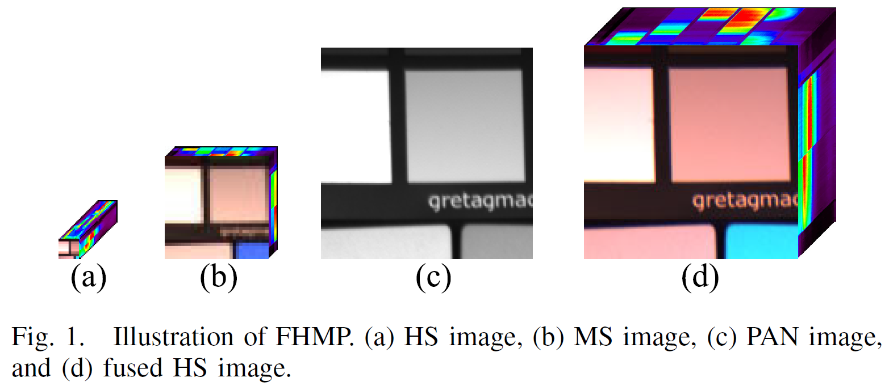

<div align="center">   
   
# HMPNet: Interpretable Model-Driven Deep Network for Hyperspectral, Multispectral, and Panchromatic Image Fusion

</div>
   
   

## Abstract
Simultaneously fusing hyperspectral (HS), multispectral (MS), and panchromatic (PAN) images brings a new paradigm to generate a high-resolution HS (HRHS) image. In this study, we propose an interpretable model-driven deep network for HS, MS, and PAN image fusion, called HMPNet. We first propose a new fusion model that utilizes a deep before describing the complicated relationship between the HRHS and PAN images owing to their large resolution difference. Consequently, the difficulty of traditional model-based approaches in designing suitable hand-crafted priors can be alleviated because this deep prior is learned from data. We further solve the optimization problem of this fusion model based on the proximal gradient descent (PGD) algorithm, achieved by a series of iterative steps. By unrolling these iterative steps into several network modules, we finally obtain the HMPNet. Therefore, all parameters besides the deep prior are learned in the deep network, simplifying the selection of optimal parameters in the fusion and achieving a favorable equilibrium between the spatial and spectral qualities. Meanwhile, all modules contained in the HMPNet have explainable physical meanings, which can improve its generalization capability. In the experiment, we exhibit the advantages of the HMPNet over other state-of-the-art methods from the aspects of visual comparison and quantitative analysis, where a series of simulated as well as real datasets are utilized for validation.


## Getting Started
Recommanded Env: torch1.10+python3.7   
   
Prepare Dataset
<!-- update .m files later -->
    
Run and Eval easily
```sh
cd HMPNet/
python main_train_hmpnet.py 
python main_test_hmpnet.py 
```
<!-- some comparatstive methods in dir "./utils/comparative_nets" for reference-->
   
   
## Bibtex
If this work is helpful for your research, please consider citing the following BibTeX entry.   
```
@ARTICLE{10138912,
  author={Tian, Xin and Li, Kun and Zhang, Wei and Wang, Zhongyuan and Ma, Jiayi},
  journal={IEEE Transactions on Neural Networks and Learning Systems}, 
  title={Interpretable Model-Driven Deep Network for Hyperspectral, Multispectral, and Panchromatic Image Fusion}, 
  year={2023},
  volume={},
  number={},
  pages={1-14},
  doi={10.1109/TNNLS.2023.3278928}}

```

